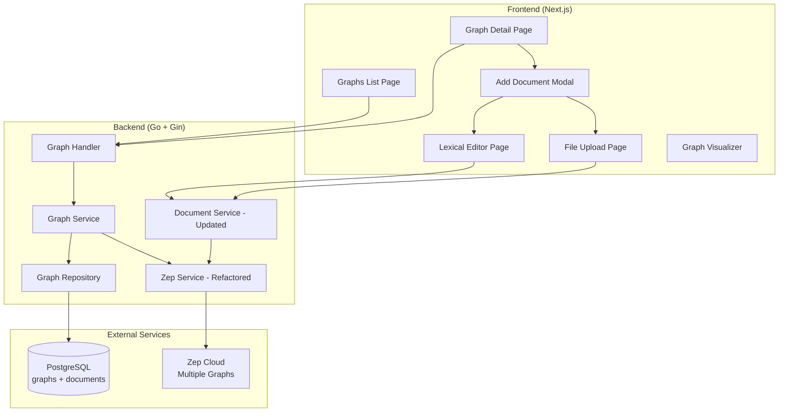
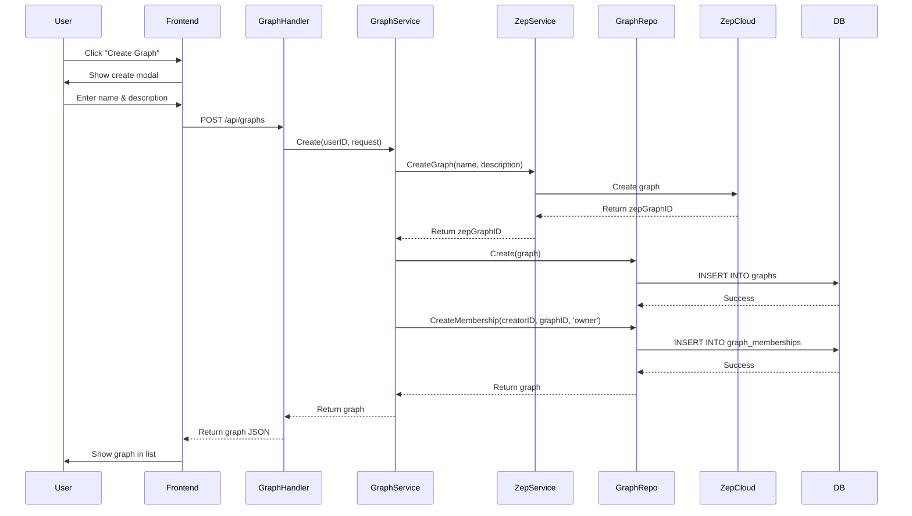
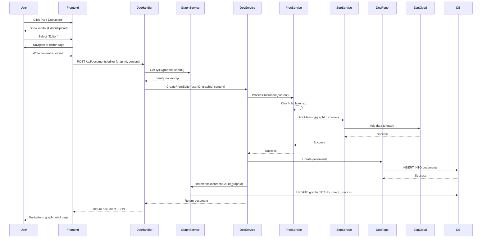
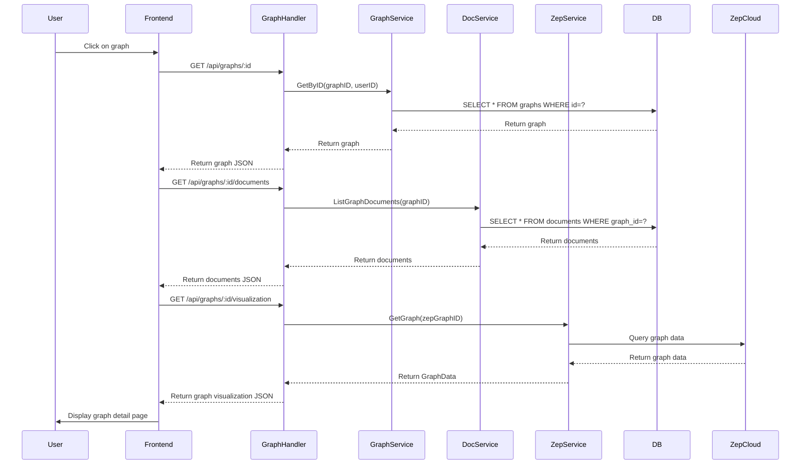

# Design Document

## Overview

This design extends OrgMind to support multi-tenant graph management, enabling users to create and manage multiple isolated knowledge graphs. The implementation adds a new `graphs` database table, refactors the Zep service to use graph IDs, and introduces new UI pages for graph management. The design maintains backward compatibility with existing APIs while adding new graph CRUD endpoints.

### Key Changes
- **Database**: New `graphs` table with foreign key to `users` and updated `documents` table with `graph_id` foreign key
- **Backend**: New `GraphService` and `GraphRepository` for graph CRUD operations
- **Backend**: Refactored `ZepService` to accept `graphID` parameter for all operations
- **Frontend**: New graphs list page, graph detail page, and document selection modal
- **Frontend**: Updated document editor and upload pages to accept graph context

## Architecture

### High-Level Architecture Changes



### Updated Frontend Architecture

```
frontend/
├── app/
│   ├── (auth)/
│   │   ├── graphs/
│   │   │   ├── page.tsx                    # NEW: Graphs list page
│   │   │   └── [graphId]/
│   │   │       ├── page.tsx                # NEW: Graph detail page
│   │   │       ├── editor/
│   │   │       │   └── page.tsx            # NEW: Editor with graph context
│   │   │       ├── upload/
│   │   │       │   └── page.tsx            # NEW: Upload with graph context
│   │   │       └── documents/
│   │   │           └── [documentId]/
│   │   │               └── page.tsx        # NEW: Document view/edit page
│   │   └── home/
│   │       └── page.tsx                    # UPDATED: Redirect to /graphs
├── components/
│   ├── graphs/
│   │   ├── GraphsList.tsx                  # NEW: Graphs list component
│   │   ├── GraphCard.tsx                   # NEW: Individual graph card
│   │   ├── CreateGraphModal.tsx            # NEW: Create graph modal
│   │   ├── EditGraphModal.tsx              # NEW: Edit graph modal
│   │   ├── DeleteGraphDialog.tsx           # NEW: Delete confirmation
│   │   ├── GraphDetail.tsx                 # NEW: Graph detail component
│   │   ├── DocumentsList.tsx               # NEW: Documents list in graph
│   │   └── AddDocumentModal.tsx            # NEW: Document type selection modal
│   ├── editor/
│   │   └── LexicalEditor.tsx               # UPDATED: Accept graphId prop
│   ├── upload/
│   │   └── FileUpload.tsx                  # UPDATED: Accept graphId prop
│   └── graph/
│       └── GraphVisualizer.tsx             # UPDATED: Accept graphId prop
├── lib/
│   ├── api/
│   │   ├── graphs.ts                       # NEW: Graph CRUD API calls
│   │   ├── documents.ts                    # UPDATED: Add graphId parameter
│   │   └── index.ts
│   └── types/
│       └── index.ts                        # UPDATED: Add Graph type
```

### Updated Backend Architecture

```
backend/
├── internal/
│   ├── handler/
│   │   ├── graph_handler.go                # NEW: Graph CRUD handlers
│   │   ├── document_handler.go             # UPDATED: Add graph context
│   │   └── auth_handler.go
│   ├── service/
│   │   ├── graph_service.go                # NEW: Graph business logic
│   │   ├── zep_service.go                  # UPDATED: Add graphID parameter
│   │   ├── document_service.go             # UPDATED: Add graph association
│   │   ├── processing_service.go
│   │   └── interfaces.go                   # UPDATED: Add GraphService interface
│   ├── repository/
│   │   ├── graph_repository.go             # NEW: Graph data access
│   │   ├── document_repository.go          # UPDATED: Add graph queries
│   │   └── interfaces.go                   # UPDATED: Add GraphRepository interface
│   ├── models/
│   │   ├── graph.go                        # NEW: Graph model
│   │   ├── document.go                     # UPDATED: Add GraphID field
│   │   └── user.go
│   └── router/
│       └── router.go                       # UPDATED: Add graph routes
├── migrations/
│   └── 002_add_graphs_table.up.sql         # NEW: Graphs table migration
│   └── 002_add_graphs_table.down.sql       # NEW: Rollback migration
```

## Components and Interfaces

### Database Schema Changes

#### New Graphs Table

```sql
-- Create graphs table
CREATE TABLE graphs (
    id UUID PRIMARY KEY DEFAULT gen_random_uuid(),
    creator_id UUID NOT NULL REFERENCES users(id) ON DELETE CASCADE,
    zep_graph_id VARCHAR(255) UNIQUE NOT NULL,
    name VARCHAR(255) NOT NULL,
    description TEXT,
    document_count INTEGER DEFAULT 0,
    created_at TIMESTAMP DEFAULT NOW(),
    updated_at TIMESTAMP DEFAULT NOW()
);

CREATE INDEX idx_graphs_creator_id ON graphs(creator_id);
CREATE INDEX idx_graphs_zep_graph_id ON graphs(zep_graph_id);
```

#### New Graph Memberships Table

```sql
-- Create graph_memberships table (many-to-many relationship)
CREATE TABLE graph_memberships (
    id UUID PRIMARY KEY DEFAULT gen_random_uuid(),
    graph_id UUID NOT NULL REFERENCES graphs(id) ON DELETE CASCADE,
    user_id UUID NOT NULL REFERENCES users(id) ON DELETE CASCADE,
    role VARCHAR(50) DEFAULT 'member',  -- Future: 'owner', 'editor', 'viewer'
    created_at TIMESTAMP DEFAULT NOW(),
    UNIQUE(graph_id, user_id)
);

CREATE INDEX idx_graph_memberships_graph_id ON graph_memberships(graph_id);
CREATE INDEX idx_graph_memberships_user_id ON graph_memberships(user_id);
CREATE INDEX idx_graph_memberships_lookup ON graph_memberships(user_id, graph_id);
```

#### Updated Documents Table

```sql
-- Add graph_id column to documents table
ALTER TABLE documents 
ADD COLUMN graph_id UUID REFERENCES graphs(id) ON DELETE CASCADE;

CREATE INDEX idx_documents_graph_id ON documents(graph_id);

-- Make graph_id NOT NULL after data migration
-- ALTER TABLE documents ALTER COLUMN graph_id SET NOT NULL;
```

### Backend Models

#### Graph Model

```go
type Graph struct {
    ID            string    `json:"id" db:"id"`
    CreatorID     string    `json:"creatorId" db:"creator_id"`
    ZepGraphID    string    `json:"zepGraphId" db:"zep_graph_id"`
    Name          string    `json:"name" db:"name"`
    Description   *string   `json:"description" db:"description"`
    DocumentCount int       `json:"documentCount" db:"document_count"`
    CreatedAt     time.Time `json:"createdAt" db:"created_at"`
    UpdatedAt     time.Time `json:"updatedAt" db:"updated_at"`
}

type GraphMembership struct {
    ID        string    `json:"id" db:"id"`
    GraphID   string    `json:"graphId" db:"graph_id"`
    UserID    string    `json:"userId" db:"user_id"`
    Role      string    `json:"role" db:"role"`  // 'owner', 'editor', 'viewer', 'member'
    CreatedAt time.Time `json:"createdAt" db:"created_at"`
}

type CreateGraphRequest struct {
    Name        string  `json:"name" binding:"required,min=1,max=255"`
    Description *string `json:"description" binding:"omitempty,max=1000"`
}

type UpdateGraphRequest struct {
    Name        *string `json:"name" binding:"omitempty,min=1,max=255"`
    Description *string `json:"description" binding:"omitempty,max=1000"`
}

type AddMemberRequest struct {
    UserID string `json:"userId" binding:"required"`
    Role   string `json:"role" binding:"omitempty,oneof=member editor viewer"`
}
```

#### Updated Document Model

```go
type Document struct {
    ID           string    `json:"id" db:"id"`
    UserID       string    `json:"userId" db:"user_id"`
    GraphID      *string   `json:"graphId" db:"graph_id"`  // NEW: Graph association
    Filename     *string   `json:"filename" db:"filename"`
    ContentType  *string   `json:"contentType" db:"content_type"`
    StorageKey   string    `json:"storageKey" db:"storage_key"`
    SizeBytes    int64     `json:"sizeBytes" db:"size_bytes"`
    Source       string    `json:"source" db:"source"` // "editor" or "upload"
    Status       string    `json:"status" db:"status"`
    ZepSessionID *string   `json:"zepSessionId" db:"zep_session_id"`
    CreatedAt    time.Time `json:"createdAt" db:"created_at"`
    UpdatedAt    time.Time `json:"updatedAt" db:"updated_at"`
}
```

### Backend Interfaces

#### GraphService Interface

```go
type GraphService interface {
    // Create a new graph for a user (creator becomes owner)
    Create(ctx context.Context, creatorID string, req *CreateGraphRequest) (*Graph, error)
    
    // Get a graph by ID with membership verification
    GetByID(ctx context.Context, graphID, userID string) (*Graph, error)
    
    // List all graphs the user is a member of
    ListByUserID(ctx context.Context, userID string) ([]*Graph, error)
    
    // Update graph metadata (creator only)
    Update(ctx context.Context, graphID, userID string, req *UpdateGraphRequest) (*Graph, error)
    
    // Delete a graph and all associated data (creator only)
    Delete(ctx context.Context, graphID, userID string) error
    
    // Add a member to a graph (creator only)
    AddMember(ctx context.Context, graphID, creatorID string, req *AddMemberRequest) error
    
    // Remove a member from a graph (creator only)
    RemoveMember(ctx context.Context, graphID, creatorID, memberUserID string) error
    
    // List all members of a graph
    ListMembers(ctx context.Context, graphID, userID string) ([]*GraphMembership, error)
    
    // Check if user is a member of a graph
    IsMember(ctx context.Context, graphID, userID string) (bool, error)
    
    // Increment document count for a graph
    IncrementDocumentCount(ctx context.Context, graphID string) error
    
    // Decrement document count for a graph
    DecrementDocumentCount(ctx context.Context, graphID string) error
}
```

#### GraphRepository Interface

```go
type GraphRepository interface {
    // Create a new graph record
    Create(ctx context.Context, graph *Graph) error
    
    // Get graph by ID
    GetByID(ctx context.Context, graphID string) (*Graph, error)
    
    // Get graph by Zep graph ID
    GetByZepGraphID(ctx context.Context, zepGraphID string) (*Graph, error)
    
    // List all graphs where user is a member (via graph_memberships)
    ListByUserID(ctx context.Context, userID string) ([]*Graph, error)
    
    // Update graph metadata
    Update(ctx context.Context, graph *Graph) error
    
    // Delete graph
    Delete(ctx context.Context, graphID string) error
    
    // Update document count
    UpdateDocumentCount(ctx context.Context, graphID string, delta int) error
    
    // Create a graph membership
    CreateMembership(ctx context.Context, membership *GraphMembership) error
    
    // Delete a graph membership
    DeleteMembership(ctx context.Context, graphID, userID string) error
    
    // Get membership by graph and user
    GetMembership(ctx context.Context, graphID, userID string) (*GraphMembership, error)
    
    // List all members of a graph
    ListMembersByGraphID(ctx context.Context, graphID string) ([]*GraphMembership, error)
    
    // Check if user is a member of a graph
    IsMember(ctx context.Context, graphID, userID string) (bool, error)
}
```

#### Updated ZepService Interface

```go
type ZepService interface {
    // Create a new graph in Zep Cloud
    CreateGraph(ctx context.Context, graphID, name string, description *string) (string, error)
    
    // Delete a graph from Zep Cloud
    DeleteGraph(ctx context.Context, zepGraphID string) error
    
    // Add memory to a specific graph (UPDATED: added graphID parameter)
    AddMemory(ctx context.Context, graphID string, chunks []string, metadata map[string]interface{}) error
    
    // Get graph data for visualization (UPDATED: added graphID parameter)
    GetGraph(ctx context.Context, graphID string) (*GraphData, error)
    
    // Search memory in a specific graph (UPDATED: added graphID parameter)
    SearchMemory(ctx context.Context, graphID, query string) ([]MemoryResult, error)
}
```

#### Updated DocumentService Interface

```go
type DocumentService interface {
    // Create document from editor with graph context (UPDATED: added graphID)
    CreateFromEditor(ctx context.Context, userID, graphID, content string) (*Document, error)
    
    // Create document from file with graph context (UPDATED: added graphID)
    CreateFromFile(ctx context.Context, userID, graphID string, file multipart.File, filename string) (*Document, error)
    
    // Get document by ID
    GetDocument(ctx context.Context, documentID string) (*Document, error)
    
    // List documents for a user
    ListUserDocuments(ctx context.Context, userID string) ([]*Document, error)
    
    // List documents for a specific graph (NEW)
    ListGraphDocuments(ctx context.Context, graphID string) ([]*Document, error)
    
    // Update document content (NEW)
    UpdateDocument(ctx context.Context, documentID, userID, content string) (*Document, error)
    
    // Delete document (NEW)
    DeleteDocument(ctx context.Context, documentID, userID string) error
}
```

### Frontend TypeScript Types

```typescript
export interface Graph {
  id: string;
  creatorId: string;
  zepGraphId: string;
  name: string;
  description?: string;
  documentCount: number;
  createdAt: string;
  updatedAt: string;
}

export interface GraphMembership {
  id: string;
  graphId: string;
  userId: string;
  role: 'owner' | 'editor' | 'viewer' | 'member';
  createdAt: string;
}

export interface CreateGraphRequest {
  name: string;
  description?: string;
}

export interface UpdateGraphRequest {
  name?: string;
  description?: string;
}

export interface AddMemberRequest {
  userId: string;
  role?: 'member' | 'editor' | 'viewer';
}

export interface Document {
  id: string;
  userId: string;
  graphId?: string;  // NEW: Graph association
  filename?: string;
  contentType?: string;
  sizeBytes: number;
  source: 'editor' | 'upload';
  status: 'processing' | 'completed' | 'failed';
  createdAt: string;
  updatedAt: string;
}

export interface DocumentType {
  type: 'editor' | 'upload';
  label: string;
  description: string;
  icon: string;
}
```

## API Endpoints

### New Graph Endpoints

```
GET    /api/graphs                    # List all graphs user is a member of
POST   /api/graphs                    # Create a new graph (user becomes creator/owner)
GET    /api/graphs/:id                # Get graph details (requires membership)
PUT    /api/graphs/:id                # Update graph metadata (creator only)
DELETE /api/graphs/:id                # Delete graph and all data (creator only)
GET    /api/graphs/:id/documents      # List documents in a graph (requires membership)
GET    /api/graphs/:id/visualization  # Get graph visualization data (requires membership)
POST   /api/graphs/:id/members        # Add a member to graph (creator only)
DELETE /api/graphs/:id/members/:userId # Remove a member from graph (creator only)
GET    /api/graphs/:id/members        # List all members of a graph (requires membership)
```

### Updated Document Endpoints

```
POST   /api/documents/editor          # Create document from editor (add graphId in body)
POST   /api/documents/upload          # Upload file (add graphId in body)
GET    /api/documents/:id             # Get document details
PUT    /api/documents/:id             # Update document content (NEW)
DELETE /api/documents/:id             # Delete document (NEW)
GET    /api/documents                 # List user documents (optional graphId query param)
```

## Data Flow

### Creating a Graph



### Adding Document to Graph



### Viewing Graph Detail



## Frontend Components

### GraphsList Component

```typescript
interface GraphsListProps {
  graphs: Graph[];
  onCreateGraph: () => void;
  onEditGraph: (graph: Graph) => void;
  onDeleteGraph: (graphId: string) => void;
  onGraphClick: (graphId: string) => void;
}

// Features:
// - Grid layout of graph cards
// - Create new graph button
// - Empty state when no graphs exist
// - Loading state during fetch
```

### GraphCard Component

```typescript
interface GraphCardProps {
  graph: Graph;
  onEdit: () => void;
  onDelete: () => void;
  onClick: () => void;
}

// Features:
// - Display graph name, description
// - Show document count badge
// - Show creation date
// - Edit and delete action buttons
// - Click to navigate to detail page
```

### GraphDetail Component

```typescript
interface GraphDetailProps {
  graph: Graph;
  documents: Document[];
  onAddDocument: () => void;
  onDocumentClick: (documentId: string) => void;
}

// Features:
// - Display graph name and description
// - Show document count
// - List all documents with type indicators
// - Add document button
// - Graph visualizer section
```

### AddDocumentModal Component

```typescript
interface AddDocumentModalProps {
  isOpen: boolean;
  onClose: () => void;
  onSelectType: (type: 'editor' | 'upload') => void;
  graphId: string;
}

// Features:
// - Two large buttons: "Create Document" and "Upload File"
// - Icons and descriptions for each option
// - Navigate to appropriate page on selection
```

### DocumentsList Component

```typescript
interface DocumentsListProps {
  documents: Document[];
  onDocumentClick: (documentId: string) => void;
}

// Features:
// - List view of documents
// - Show document name, type icon, date, size
// - Click to view/edit document
// - Empty state when no documents
```

## Implementation Strategy

### Phase 1: Database and Backend Foundation
1. Create migration for `graphs` table with `creator_id`
2. Create migration for `graph_memberships` table (many-to-many)
3. Update `documents` table with `graph_id` column
4. Implement `Graph` and `GraphMembership` models
5. Implement `GraphRepository` with membership methods
6. Implement `GraphService` with CRUD and membership operations
7. Refactor `ZepService` to accept `graphID` parameter

### Phase 2: Backend API Endpoints
1. Create `GraphHandler` with CRUD endpoints
2. Add membership management endpoints (add/remove/list members)
3. Update `DocumentHandler` to accept `graphId` in requests
4. Add graph membership verification middleware
5. Add graph creator verification for sensitive operations
6. Update document creation to associate with graph
7. Implement document count increment/decrement

### Phase 3: Frontend Graph Management
1. Create TypeScript types for `Graph`
2. Implement graph API client functions
3. Create graphs list page
4. Implement create/edit/delete graph modals
5. Create graph card component

### Phase 4: Frontend Graph Detail
1. Create graph detail page
2. Implement documents list component
3. Create add document modal
4. Update editor page to accept graph context
5. Update upload page to accept graph context

### Phase 5: Integration and Testing
1. Update home page to redirect to graphs list
2. Test graph CRUD operations
3. Test document creation with graph context
4. Test graph visualization with multiple graphs
5. Test ownership verification and authorization

## Error Handling

### Backend Error Scenarios

```go
var (
    ErrGraphNotFound         = &AppError{Code: "GRAPH_NOT_FOUND", Message: "Graph not found", Status: 404}
    ErrGraphUnauthorized     = &AppError{Code: "GRAPH_UNAUTHORIZED", Message: "You don't have access to this graph", Status: 403}
    ErrGraphNameRequired     = &AppError{Code: "GRAPH_NAME_REQUIRED", Message: "Graph name is required", Status: 400}
    ErrNotGraphCreator       = &AppError{Code: "NOT_GRAPH_CREATOR", Message: "Only the graph creator can perform this action", Status: 403}
    ErrNotGraphMember        = &AppError{Code: "NOT_GRAPH_MEMBER", Message: "You are not a member of this graph", Status: 403}
    ErrMemberAlreadyExists   = &AppError{Code: "MEMBER_ALREADY_EXISTS", Message: "User is already a member of this graph", Status: 400}
    ErrZepGraphCreation      = &AppError{Code: "ZEP_GRAPH_CREATION_FAILED", Message: "Failed to create graph in Zep Cloud", Status: 500}
    ErrZepGraphDeletion      = &AppError{Code: "ZEP_GRAPH_DELETION_FAILED", Message: "Failed to delete graph from Zep Cloud", Status: 500}
)

// Graph membership verification
func (s *GraphService) verifyMembership(ctx context.Context, graphID, userID string) (*Graph, error) {
    graph, err := s.repo.GetByID(ctx, graphID)
    if err != nil {
        return nil, ErrGraphNotFound
    }
    
    isMember, err := s.repo.IsMember(ctx, graphID, userID)
    if err != nil {
        return nil, err
    }
    
    if !isMember {
        return nil, ErrNotGraphMember
    }
    
    return graph, nil
}

// Graph creator verification (for update/delete operations)
func (s *GraphService) verifyCreator(ctx context.Context, graphID, userID string) (*Graph, error) {
    graph, err := s.repo.GetByID(ctx, graphID)
    if err != nil {
        return nil, ErrGraphNotFound
    }
    
    if graph.CreatorID != userID {
        return nil, ErrNotGraphCreator
    }
    
    return graph, nil
}
```

### Frontend Error Handling

```typescript
// Graph API error handling
export async function createGraph(request: CreateGraphRequest): Promise<Graph> {
  try {
    return await apiCall<Graph>('/api/graphs', {
      method: 'POST',
      body: JSON.stringify(request),
    });
  } catch (error) {
    if (error instanceof APIError) {
      if (error.statusCode === 500 && error.details?.code === 'ZEP_GRAPH_CREATION_FAILED') {
        throw new Error('Failed to create knowledge graph. Please try again.');
      }
    }
    throw error;
  }
}

// Component error boundaries
// - Wrap graph pages with error boundary
// - Display user-friendly error messages
// - Provide retry actions for failed operations
```

## Migration Strategy

### Data Migration for Existing Users

For users who already have documents in the system without graph associations:

```go
// Migration function to create default graph for existing users
func MigrateExistingDocuments(ctx context.Context, db *sqlx.DB, zepService ZepService) error {
    // 1. Find all users with documents but no graphs
    users, err := findUsersWithoutGraphs(ctx, db)
    if err != nil {
        return err
    }
    
    for _, user := range users {
        // 2. Create a default graph for each user
        zepGraphID, err := zepService.CreateGraph(ctx, 
            fmt.Sprintf("user-%s-default", user.ID),
            "My Knowledge Graph",
            ptr("Default graph created during migration"),
        )
        if err != nil {
            log.Printf("Failed to create graph for user %s: %v", user.ID, err)
            continue
        }
        
        // 3. Insert graph record
        graph := &Graph{
            ID:         uuid.New().String(),
            CreatorID:  user.ID,
            ZepGraphID: zepGraphID,
            Name:       "My Knowledge Graph",
            Description: ptr("Default graph created during migration"),
        }
        
        if err := createGraph(ctx, db, graph); err != nil {
            log.Printf("Failed to save graph for user %s: %v", user.ID, err)
            continue
        }
        
        // 3.5. Create graph membership for the creator
        membership := &GraphMembership{
            ID:      uuid.New().String(),
            GraphID: graph.ID,
            UserID:  user.ID,
            Role:    "owner",
        }
        
        if err := createMembership(ctx, db, membership); err != nil {
            log.Printf("Failed to create membership for user %s: %v", user.ID, err)
            continue
        }
        
        // 4. Update all user's documents to reference the new graph
        if err := updateDocumentsWithGraph(ctx, db, user.ID, graph.ID); err != nil {
            log.Printf("Failed to update documents for user %s: %v", user.ID, err)
            continue
        }
        
        // 5. Update document count
        count, _ := countUserDocuments(ctx, db, user.ID)
        updateGraphDocumentCount(ctx, db, graph.ID, count)
    }
    
    return nil
}
```

## Security Considerations

1. **Graph Membership Verification**
   - All graph read operations must verify the user is a member of the graph
   - All graph write/delete operations must verify the user is the creator
   - Middleware to extract userID from JWT and validate against graph_memberships table
   - Return 403 Forbidden for unauthorized access attempts
   - Prevent users from accessing graphs they are not members of

2. **Document-Graph Association**
   - Verify graph membership before allowing document creation
   - Prevent users from adding documents to graphs they are not members of
   - Cascade delete documents when graph is deleted
   - Cascade delete memberships when graph is deleted

3. **Zep Graph Isolation**
   - Each Zep graph is isolated by unique graphID
   - No cross-graph data leakage
   - Graph deletion removes all associated data from Zep Cloud

4. **Input Validation**
   - Validate graph name length (1-255 characters)
   - Validate description length (max 1000 characters)
   - Sanitize user input to prevent injection attacks

## Testing Strategy

### Backend Unit Tests

```go
// GraphService tests
func TestGraphService_Create(t *testing.T) {
    // Test successful graph creation
    // Test Zep graph creation failure
    // Test database insertion failure
}

func TestGraphService_VerifyMembership(t *testing.T) {
    // Test valid membership
    // Test non-member access
    // Test non-existent graph
}

func TestGraphService_VerifyCreator(t *testing.T) {
    // Test valid creator
    // Test non-creator access
    // Test member but not creator
}

func TestGraphService_AddMember(t *testing.T) {
    // Test adding member successfully
    // Test adding duplicate member
    // Test non-creator attempting to add member
}

// GraphRepository tests
func TestGraphRepository_ListByUserID(t *testing.T) {
    // Test listing graphs for user
    // Test empty result for user with no graphs
    // Test filtering by user ID
}
```

### Frontend Component Tests

```typescript
// GraphsList component tests
describe('GraphsList', () => {
  it('renders list of graphs', () => {});
  it('shows empty state when no graphs', () => {});
  it('calls onCreateGraph when create button clicked', () => {});
  it('navigates to graph detail on card click', () => {});
});

// AddDocumentModal tests
describe('AddDocumentModal', () => {
  it('displays two document type options', () => {});
  it('navigates to editor when editor option selected', () => {});
  it('navigates to upload when upload option selected', () => {});
});
```

### Integration Tests

1. **Graph CRUD Flow**
   - Create graph → List graphs → Update graph → Delete graph
   - Verify Zep Cloud graph creation and deletion
   - Verify database consistency

2. **Document Creation Flow**
   - Create graph → Add document → Verify document in list
   - Verify document count increment
   - Verify Zep memory addition with correct graphID

3. **Authorization Flow**
   - User A creates graph → User B attempts access → Verify 403
   - User A adds User B as member → User B can access graph
   - User B attempts to delete graph → Verify 403 (only creator can delete)
   - User A adds document to graph → Verify association
   - User A deletes graph → Verify cascade delete of documents and memberships

## Performance Considerations

1. **Database Queries**
   - Index on `graphs.user_id` for fast user graph lookups
   - Index on `documents.graph_id` for fast document listing
   - Use pagination for large document lists

2. **Zep API Calls**
   - Implement retry logic with exponential backoff
   - Cache graph visualization data (5-minute TTL)
   - Batch document additions when possible

3. **Frontend Optimization**
   - Lazy load graph visualizations
   - Implement infinite scroll for document lists
   - Cache graph list data with React Query
   - Optimistic UI updates for graph CRUD operations

## Deployment Considerations

### Database Migration

```bash
# Run migration to add graphs and graph_memberships tables
migrate -path ./migrations -database $DATABASE_URL up

# Run data migration for existing users (creates default graph and membership)
go run cmd/migrate/main.go --migrate-existing-documents
```

### Environment Variables

No new environment variables required. Existing Zep configuration will be used.

### Rollback Plan

If issues arise:
1. Revert frontend deployment to previous version
2. Revert backend deployment to previous version
3. Run down migration to remove `graphs` table
4. Restore database from backup if necessary

The design maintains backward compatibility, so rollback should be straightforward.
